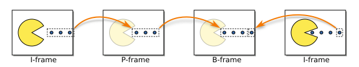

*※ 참고: 기억의 한계로 이 시리즈의 글은 실제 시간 순서와 글/서술의 순서가 불일치할 수 있다. 또한 이 시리지의 글들은 2024년 1학기때의 일을 쓴 글들이다.*

# 들어가는 글
보통 리듬게임에는 각 노래마다 배경 영상(이하 `BGA`)이 있기 마련이다. 이 게임은 [지난 글](../bidrum_on_rust/)에서 밝혔다시피 직접 SDL2를 이용했다. 따라서 비디오 렌더링을 직접 구현해야 했다.

이를 직접 구현하려면 아무래도 [FFMpeg](https://ffmpeg.org/)을 활용해야 했다. 따라서 [인터넷 상의 Rust 예시코드](https://github.com/RustWorks/spe-FFMPEG-SDL2-Video-Player) 등을 참고하여 작성했다. [^1]

이러한 FFMpeg를 이용한 렌더링 코드는 다음과 같은 식으로 작성된다. 의사 코드로 간단히 나타냈다.

```
input = 파일 데이터 (참고: 하나의 파일은 여러개의 스트림으로 구성됨)
video-decoder = 비디오 디코더

while (파일에서 모든 패킷을 읽을때까지) {
    packet = 파일에서 읽은 다음 패킷
    if (패킷이 비디오 스트림이라면) {
        video-decoder.send_packet(패킷)
        렌더링 된 프레임 데이터 = video-decoder.receive_frame()
    }
}
```

# 싱크 맞추기
## 시간 맞추기
배경 영상과 음악은 분리되어야 한다. 그래야 BGA가 없는 음악에도 범용 BGA[^2]를 쓸 수 있다. 그런데 이 두개가 분리될 시 음악과 영상의 싱크를 맞추어야 한다는 문제가 생긴다.

처음에는 단순하게 생각했다. 그냥 매 게임 프레임마다 영상 플레이지점(이하 `position`)을 설정하면 되는 게 아닌가? 그래서 매 게임 프레임마다 input의 읽던 위치를 바꿔주는 [av_seek_frame](https://ffmpeg.org/doxygen/trunk/group__lavf__decoding.html#gaa23f7619d8d4ea0857065d9979c75ac8) api를 호출했다.

그랬더니 오류[^3]가 발생한다. api 호출시 매개변수 문제인가 싶어서 [AVSEEK_FLAG_FRAME](https://ffmpeg.org/doxygen/trunk/avformat_8h.html#ab83ca408a574b40c76f681b616096fc8)을 걸어봤더니 렌더링은 되는데 오차가 너무 심했다. (4.8초로 api를 호출해도 1초 시점의 프레임이 렌더링되는 등의 버그가 발생)

왜 그럴까?

## 키프레임과 델타프레임
영상 인코딩에는 **키 프레임**(**keyframe**)이라는 개념이 있다.

인코딩을 잘 모른다면 영상 파일이 다음과 같은 이미지의 집합이라 생각할 수도 있다.

| 1프레임 | 2프레임 | 3프레임 | 4프레임 |
| --- | --- | --- | --- |
|  |  |  |  |

(대충 보면 다 같은 이미지로 보일 수 있는데 자세히 보면 조금씩 차이가 있는 이미지들이다)

그러나 실제 영상 파일의 다음과 같은 프레임들로 이루어져 있다.



위에서 I-frame[^4]이 키프레임이고, P/B-frame이 중간 프레임[^5]이다. 키프레임은 프레임 그 자체로 하나의 온전한 이미지이다. 그러나 P/B-frame은 앞/뒤 프레임과의 차이점(delta)만을 가진다. 

즉 하나의 중간 프레임이 완전히 렌더링되기 위해서는 앞선 프레임 데이터를 모두 가지고 있어야 한다. 예를 들어 어떤 영상에서 프레임 7이 키프레임이고 프레임 8,9,10,11이 중간 프레임이라고 하자. 그러면 디코더가 프레임 10을 렌더링하기 위해서는 프레임 7,8,9,10의 데이터를 모두 가지고 있어야 한다.

그렇기에 FFMpeg에서 무턱대고 seek를 하면 종종 앞선 프레임의 데이터가 누락되므로 오류나 버그가 발생하게 된다.

```
예시: 비디오 파일에서 프레임 7이 키프레임이고, 프레임 8,9,10이 중간 프레임인 경우

1. 비디오 디코더는 프레임 3 쯤을 디코딩하고 있었음
2. 갑자기 av_seek_frame으로 input의 위치를 프레임 10으로 변경함
3. 프레임 3 렌더링하던 비디오 디코더가 바로 프레임 10 패킷을 받게 됨.
4. 비디오 디코더: "??? 뭐야 프레임 7/8/9 어딨어? 프레임 10만으로 어떻게 렌더링을 하라는 거야?"
5. 오류 발생!
```

## 임의의 position으로 seek하는 방법

따라서 FFMpeg에서 임의의 시점을 렌더링하는 방법은 다음과 같다.

1. 주어진 시점에, 혹은 그 앞에 위치하는 keyframe으로 input을 seek한다. (`AVSEEK_FLAG_BACKWARD`와 `AVSEEK_FLAG_FRAME` 플래그를 이용하면 된다.)
2. 원하는 position에 근접한 프레임이 나올때까지 계속 디코딩한다.

예를 들어 프레임 7이 키프레임이고 프레임 8,9,10,11,12이 중간 프레임일 때 프레임 10 쯤에 위치한 시점을 렌더링하고 싶다고 해보자. `AVSEEK_FLAG_BACKWARD`와 `AVSEEK_FLAG_FRAME` 플래그를 이용해 `av_seek_frame`을 프레임 10이 있는 시점으로 호출하면 ffmpeg이 자동으로 프레임 7부터 읽게 된다. 그러면 디코딩을 계속하며 프레임 7/8/9가 디코딩 됐을 때는 그냥 무시하다가 프레임 10이 디코딩됐을 때에 그 데이터를 쓰면 된다.

## 그러나 리듬게임이라면?
그런데 생각해보자. 리듬게임에서 BGA를 "거꾸로" 재생할 일이 있을까? 없다. 오직 계속 앞으로 재생하기만 하지, 뒤로 갈 일은 없다.

그래서 싱크를 맞추는 게 사실 단순하다. 그냥 디코딩된 BGA 프레임이 너무 앞서면 그냥 무시하다가 좀 근접하면 그 프레임 데이터를 렌더링하는 식으로 하면 된다...


# 자료 출처
- 영상 출처: [ No Copyright Nature Video | Copyright Free Nature Video - NCF_HD_1080p ](https://www.youtube.com/watch?v=tOZ_C_ttLDU), CC BY License
- I/P/B 프레임 설명 이미지 출처: [I P and B frames.svg](https://commons.wikimedia.org/wiki/File:I_P_and_B_frames.svg), Public domain

---
[^1]: cpp 예시 코드도 참고했던 것 같은데 몇년 전의 일이라서 기억이 잘 안 난다....
[^2]: 배경 영상이 없는 노래에 쓰기 위한 범용 배경 영상
[^3]: 오류거나 아니면 제대로 렌더링 안되는 버그거나 둘 중 하나였던 거 같은데 기억이 잘 안 난다.
[^4]: **I**ntra frame이라서 I 프레임이다.
[^5]: inter frame 혹은 delta frame이라 불리기도 한다.